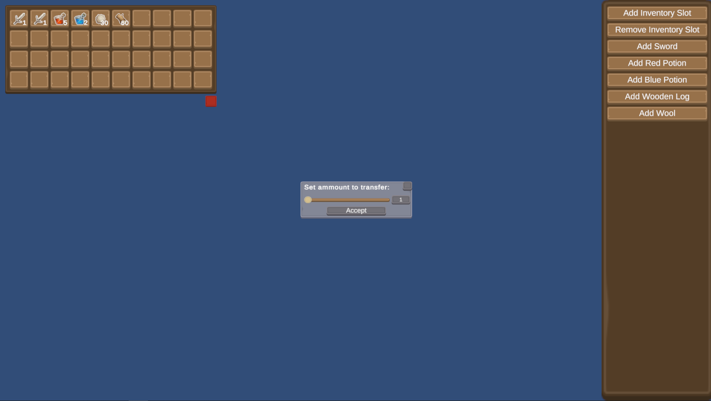

# Inventory System for Unity

This package provides an inventory system for Unity. The base it's purely on C#, and it's generic so it could be used elsewhere. The Samples are for Unity.

## How to Install

Follow the Unity guide in how to install a git package: https://docs.unity3d.com/Manual/upm-ui-giturl.html

## Samples

The package provides a sample about how to make a grid inventory, one like the ones in Minecraft or Terraria. If you are going to import this sample, be sure to also import the Commons sample.

The Sample provides a Scene and the necesary script, with a debug menu on the right that allows the user to add new slots to the inventory, remove them, or add items.

If you click on an item, it will be moved to the mouse, if you click again, it will be swapped with whatever is on the target slot.
You can also hold the left-shift key before clicking, this will show an emergent window where you can choose how many items to transfer.

